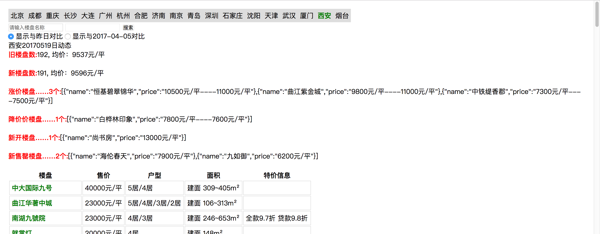
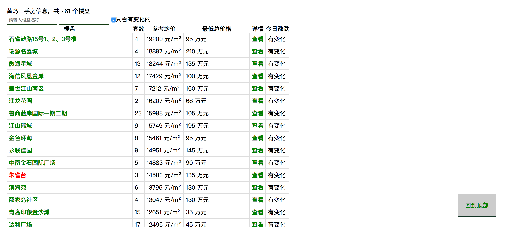
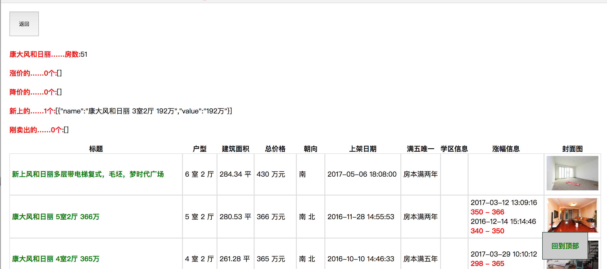

## 楼市信息

> 因为json数据量过大，已经停止上传到git

[全国大城市新房每日数据](https://loulanyijian.github.io/loushi/www/)
[黄岛二手房每日数据](https://loulanyijian.github.io/loushi/www/qdErshou.html)
[济南二手房每日数据](https://loulanyijian.github.io/loushi/www/jnErshou.html)
[北京二手房每日数据](https://loulanyijian.github.io/loushi/www/bjErshou.html)

### 环境准备
* 安装node环境
* 全局安装babel-node，用于处理es6的JS
* 全局安装或者npm install安装request包，用于抓取数据

### 代码原理
* 每天手动执行命令，抓取链家网数据（因为没服务器，无法自动跑程序）
* 抓的是链接的接口，需要验证cookie信息，因此需要从网站上先登录，再拷贝cookie信息到工程里

### 数据抓取
``` shell
// 全国大城市新房每日数据
babel-node index.js
```

``` shell
// 上海、苏州新房每日数据，暂时未做相关界面
babel-node index2.js
```

``` shell
// 黄岛二手房每日数据
babel-node qdErshou.js
```

``` shell
// 济南二手房每日数据
babel-node jnErshou.js
```

``` shell
// 北京二手房每日数据
babel-node bjErshou.js
```

### 结果展示
* 启动本地服务，例如使用`http-server`启动
* 前端使用vue展示数据、使用axios请求数据
* `http://IP:host/www/` [全国大城市新房每日、对比数据]
* `http://IP:host/www/qdErshou.html` [青岛-黄岛二手房每日数据]
	* 如果需要展示图片的话，不能使用IP启动服务，链家的图片会报403错误

### 全国大城市新房每日、对比数据-图片展示

### 青岛-黄岛二手房每日数据-查看有变化-图片展示

### 青岛-黄岛二手房每日数据-楼盘详情-图片展示



